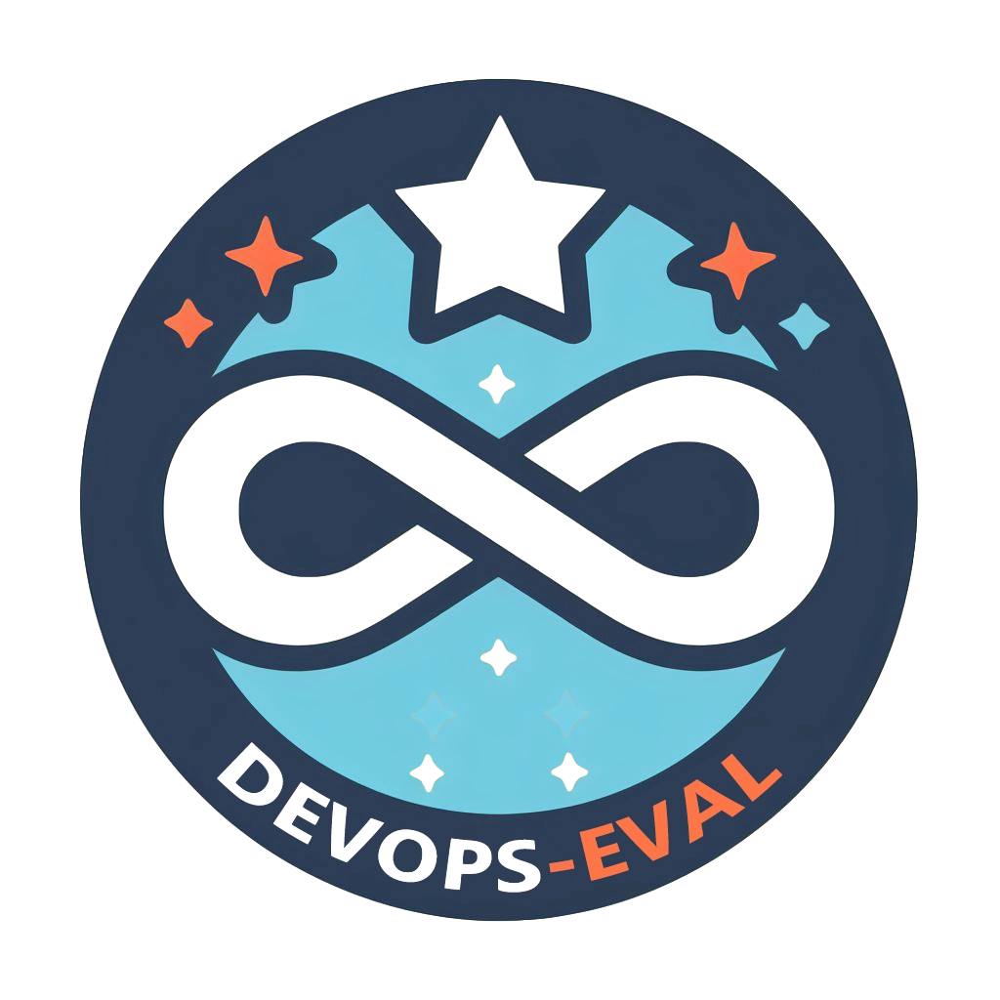

<p align="center">        </p>

# <p align="center">A DevOps Domain Knowledge Evaluation Benchmark for Large Language Models</p>


<p align="center">
  🤗 <a href="https://huggingface.co/datasets/codefuse-admin/devopseval-exam" target="_blank">Hugging Face</a> • ⏬ <a href="#data" target="_blank">Data</a> • 📖 <a href="resources/tutorial.md" target="_blank">Tutorial (ZH)</a>
  <br>
  <a href="https://github.com/codefuse-ai/codefuse-devops-eval/blob/main/README_zh.md">   中文</a> | <a href="https://github.com/codefuse-ai/codefuse-devops-eval/blob/main/README.md"> English </a>
</p>

DevOps-Eval is a comprehensive evaluation suite specifically designed for foundation models in the DevOps field. We hope DevOps-Eval could help developers, especially in the DevOps field, track the progress and analyze the important strengths/shortcomings of their models.


📚 This repo contains questions and exercises related to DevOps and AIOps.

🔥️ There are currently **2650** multiple-choice questions spanning 8 diverse disciplines, as shown [below](images/data_info.png).

<p align="center"> <a href="resources/devops_diagram_zh.jpg"> </a></p>


## 🔔 News

* **[2023.10.18]** DevOps-Eval Update the Leaderboard...
<br>

## 📜 Table of Contents

- [🏆 Leaderboard](#-leaderboard)
- [⏬ Data](#-data)
- [🚀 How to Evaluate](#-how-to-evaluate)
- [🧭 TODO](#-todo)
- [🏁 Licenses](#-licenses)
- [😃 Citation](#-citation)

## 🏆 Leaderboard
Below are zero-shot and five-shot accuracies from the models that we evaluate in the initial release. We note that five-shot performance is better than zero-shot for many instruction-tuned models.

#### Zero Shot

|      **ModelName**       | plan  | code  | build |  test  | release  | deploy | operate | monitor  | **AVG** |
|:------------------------:|:-----:|:-----:|:-----:|:------:|:--------:|:------:|:-------:|:--------:|:-----------:|
|  **DevOpsPal-14B-Chat**  | 60.61 | 78.35 | 84.86 | 84.65  |  87.26   | 82.75  |  81.34  |  79.17   |  **80.34**  |
|  **DevOpsPal-14B-Base**  | 54.55 | 77.82 | 83.49 | 85.96  |  86.32   | 81.96  |  85.82  |  82.41   |  **80.26**  |
|      Qwen-14B-Chat       | 60.61 | 75.4  | 85.32 | 84.21  |  89.62   | 82.75  |  83.58  |  80.56   |    79.28    |
|      Qwen-14B-Base       | 57.58 | 73.81 | 84.4  | 85.53  |  86.32   | 81.18  |  82.09  |  80.09   |    77.92    |
|    Baichuan2-13B-Base    | 60.61 | 69.42 | 79.82 | 79.82  |  82.55   | 81.18  |  85.07  |   83.8   |    75.10    |
|    Baichuan2-13B-Chat    | 60.61 | 68.43 | 77.98 |  80.7  |   81.6   | 83.53  |  82.09  |  84.72   |    74.60    |
|  **DevOpsPal-7B-Chat**   | 54.55 | 69.11 | 83.94 | 82.02  |  76.89   |   80   |  79.85  |  77.78   |  **74.00**  |
|  **DevOpsPal-7B-Base**   | 54.55 | 68.96 | 82.11 | 78.95  |  80.66   | 76.47  |  79.85  |   78.7   |  **73.55**  |
|       Qwen-7B-Base       | 53.03 | 68.13 | 78.9  | 75.44  |  80.19   |   80   |  83.58  |  80.09   |    73.13    |
|       Qwen-7B-Chat       | 57.58 | 66.01 | 80.28 | 79.82  |  76.89   | 77.65  |  80.6   |  79.17   |    71.96    |
|    Baichuan2-7B-Chat     | 54.55 | 63.66 | 77.98 | 76.32  |   71.7   | 73.33  |  75.37  |  79.63   |    68.17    |
|     Internlm-7B-Chat     | 60.61 | 62.15 | 77.06 | 76.32  |  66.98   | 74.51  |  74.63  |  78.24   |    68.08    |
|    Baichuan2-7B-Base     | 56.06 | 62.45 | 75.69 | 70.61  |  74.06   |  69.8  |  76.12  |  75.93   |    67.51    |
|     Internlm-7B-Base     | 54.55 | 58.29 | 79.36 | 78.95  |  77.83   | 70.59  |  78.36  |  75.93   |    66.91    |


#### Five Shot

| **ModelName**          | plan  | code  | build | test  | release | deploy | operate | monitor | **AVG** |
|:------------------------:|:-----:|:-----:|:-----:|:------:|:--------:|:------:|:-------:|:--------:|:---------:|
| **DevOpsPal-14B-Chat** |63.64 | 79.49 | 81.65 | 85.96 | 86.79 | 86.67 | 89.55 | 81.48 | **81.77** |
| **DevOpsPal-14B-Base** |  62.12 | 80.55 | 82.57 | 85.53 | 85.85 | 84.71 | 85.07 | 80.09 | **81.70** |
| Qwen-14B-Chat |  65.15 | 76 | 82.57 | 85.53 | 84.91 | 84.31 | 85.82 | 81.48 | 79.55 |
| Qwen-14B-Base |  66.67 | 76.15 | 84.4 | 85.53 | 86.32 | 80.39 | 86.57 | 80.56 | 79.51 |
| Baichuan2-13B-Base | 63.64 | 71.39 | 80.73 | 82.46 | 81.13 | 84.31 | 91.79 | 85.19 | 77.09 |
| Qwen-7B-Base | 75.76 | 72.52 | 78.9 | 81.14 | 83.96 | 81.18 | 85.07 | 81.94 | 77.02 |
| Baichuan2-13B-Chat | 62.12 | 69.95 | 76.61 | 84.21 | 83.49 | 79.61 | 88.06 | 80.56 | 75.32 |
| **DevOpsPal-7B-Chat** | 66.67 | 69.95 | 83.94 | 81.14 | 80.19 | 82.75 | 82.84 | 76.85 | **75.25** |
| **DevOpsPal-7B-Base** |  69.7 | 69.49 | 82.11 | 81.14 | 82.55 | 82.35 | 80.6 | 79.17 | **75.17** |
| Qwen-7B-Chat |  65.15 | 66.54 | 82.57 | 81.58 | 81.6 | 81.18 | 80.6 | 81.02 | 73.62 |
| Baichuan2-7B-Base | 60.61 | 67.22 | 76.61 | 75 | 77.83 | 78.43 | 80.6 | 79.63 | 72.11 |
| Internlm-7B-Chat |  60.61 | 63.06 | 79.82 | 80.26 | 67.92 | 75.69 | 73.88 | 77.31 | 71.09 |
| Baichuan2-7B-Chat |  60.61 | 64.95 | 81.19 | 75.88 | 71.23 | 75.69 | 78.36 | 79.17 | 70.49 |
| Internlm-7B-Base |  62.12 | 65.25 | 77.52 | 80.7 | 74.06 | 78.82 | 79.85 | 75.46 | 69.17 |

## ⏬ Data
#### Download
* Method 1: Download the zip file (you can also simply open the following link with the browser):
  ```
  wget https://huggingface.co/datasets/codefuse-admin/devopseval-exam/resolve/main/data.zip
  ```
  then unzip it and you may load the data with pandas:
  ```
  import os
  import pandas as pd
  
  File_Dir="devopseval-exam"
  test_df=pd.read_csv(os.path.join(File_Dir,"test","UnitTesting.csv"))
  ```
* Method 2: Directly load the dataset using [Hugging Face datasets](https://huggingface.co/datasets/DevOps-Eval/devopseval-exam):
  ```python
  from datasets import load_dataset
  dataset=load_dataset(r"DevOps-Eval/devopseval-exam",name="UnitTesting")
  
  print(dataset['val'][0])
  # {"id": 1, "question": "单元测试应该覆盖以下哪些方面？", "A": "正常路径", "B": "异常路径", "C": "边界值条件"，"D": 所有以上，"answer": "D", "explanation": ""}  ```
#### Notes
To facilitate usage, we have organized the category name handlers and English/Chinese names corresponding to 49 categories. Please refer to [category_mapping.json](https://github.com/codefuse-ai/codefuse-devops-eval/resources/category_mapping.json) for details. The format is:

```
{
  "UnitTesting.csv": [
    "unit testing",
    "单元测试",
    {"dev": 5, "test": 32}
    "TEST"
  ],
  ...
  "file_name":[
  "English Name",
  "Chinese Name",
  "Sample Number",
  "Supercatagory Label(PLAN,CODE,BUILD,TEST,RELEASE,DEPOLY,OPERATE,MONITOR choose 1 out of 8)"
  ]
}
```
Each subject consists of two splits: dev and test.  The dev set per subject consists of five exemplars with explanations for few-shot evaluation. And the test set is for model evaluation. Labels on the test split are also released.

Below is a dev example from 'version control':

```
id: 4
question: 如何找到Git特定提交中已更改的文件列表？
A: 使用命令 `git diff --name-only SHA`
B: 使用命令 `git log --name-only SHA`
C: 使用命令 `git commit --name-only SHA`
D: 使用命令 `git clone --name-only SHA`
answer: A
explanation: 
分析原因：
git diff --name-only SHA命令会显示与SHA参数对应的提交中已修改的文件列表。参数--name-only让命令只输出文件名，而忽略其他信息。其它选项中的命令并不能实现此功能。
```

## 🚀 How to Evaluate
If you need to test your own huggingface-formatted model, the overall steps are as follows:
1. Write the loader function for the model.
2. Write the context_builder function for the model.
3. Register the model in the configuration file.
4. Run the testing script.
If the model does not require any special processing after loading, and the input does not need to be converted to a specific format (e.g. chatml format or other human-bot formats), you can directly proceed to step 4 to initiate the testing.

#### 1. Write the loader function
If the model requires additional processing after loading (e.g. adjusting the tokenizer), you need to inherit the `ModelAndTokenizerLoader` class in `src.context_builder.context_builder_family.py` and override the corresponding `load_model` and `load_tokenizer` functions. You can refer to the following example:
```python
class QwenModelAndTokenizerLoader(ModelAndTokenizerLoader):
    def __init__(self):
      super().__init__()
      pass
    
    def load_model(self, model_path: str):
        model = super().load_model(model_path)
        model.generation_config = GenerationConfig.from_pretrained(model_path)
        return model

    def load_tokenizer(self, model_path: str):
        tokenizer = super().load_tokenizer(model_path)
    
        # read generation config
        with open(model_path + '/generation_config.json', 'r') as f:
        generation_config = json.load(f)
        tokenizer.pad_token_id = generation_config['pad_token_id']
        tokenizer.eos_token_id = generation_config['eos_token_id']
        return tokenizer
```

#### 2. Write the context_builder function for the Model
If the input needs to be converted to a specific format (e.g. chatml format or other human-bot formats), you need to inherit the ContextBuilder class in `src.context_builder.context_builder_family` and override the make_context function. This function is used to convert the input to the corresponding required format. An example is shown below:
```python
class QwenChatContextBuilder(ContextBuilder):
    def __init__(self):
        super().__init__()
    
    def make_context(
        self,
        model,
        tokenizer, 
        query: str,
        system: str = "you are a helpful assistant"
    ):
        '''
        model: PretrainedModel
        tokenizer: PretrainedTokenzier
        query: Input string
        system: System prompt if needed
        '''
        im_start, im_end = "<|im_start|>", "<|im_end|>"
        im_start_tokens = [tokenizer.im_start_id]
        im_end_tokens = [tokenizer.im_end_id]
        nl_tokens = tokenizer.encode("\n")

        def _tokenize_str(role, content):
            return f"{role}\n{content}", tokenizer.encode(
                role, allowed_special=set()
            ) + nl_tokens + tokenizer.encode(content, allowed_special=set())

        system_text, system_tokens_part = _tokenize_str("system", system)
        system_tokens = im_start_tokens + system_tokens_part + im_end_tokens

        raw_text = ""
        context_tokens = []

        context_tokens = system_tokens + context_tokens
        raw_text = f"{im_start}{system_text}{im_end}" + raw_text
        context_tokens += (
            nl_tokens
            + im_start_tokens
            + _tokenize_str("user", query)[1]
            + im_end_tokens
            + nl_tokens
            + im_start_tokens
            + tokenizer.encode("assistant")
            + nl_tokens
        )
        raw_text += f"\n{im_start}user\n{query}{im_end}\n{im_start}assistant\n"
        return raw_text, context_tokens
```

#### 3. Register the model in the configuration file
Go to the `model_conf.json` file in the conf directory and register the corresponding model name and the loader and context_builder that will be used for this model. Simply write the class names defined in the first and second steps for the loader and context_builder. Here is an example:
```json
{
  "Qwen-Chat": {
  "loader": "QwenModelAndTokenizerLoader",
  "context_builder": "QwenChatContextBuilder"
  }
}
```

#### 4. Execute the testing script
Run the following code to initiate the test:
```Bash
# model_path: path to the model for testing
# model_name: the model name corresponding to the model in the configuration file, default is Default, which represents using the default loader and context_builder
# model_conf_path: path to the model configuration file, usually the devopseval_dataset_fp.json file in the conf directory
# eval_dataset_list: the names of the datasets to be tested, default is all to test all datasets, if you need to test one or more datasets, use the # symbol to connect them, for example: dataset1#dataset2
# eval_dataset_fp_conf_path: path to the dataset configuration file
# eval_dataset_type: the type of testing, only supports the default test type of test dataset
# data_path: path to the evaluation dataset, fill in the downloaded dataset address
# k_shot: supports 0-5, represents the number of example prefixes added for few-shot

python src/run_eval.py \
--model_path path_to_model \
--model_name model_name_in_conf \
--model_conf_path path_to_model_conf \
--eval_dataset_list all \
--eval_dataset_fp_conf_path path_to_dataset_conf \
--eval_dataset_type test \
--data_path path_to_downloaded_devops_eval_data \
--k_shot 0
```

For example, if the evaluation dataset is downloaded to `folder1`, the code is placed in `folder2`, and the model is in `folder3`, and the model does not require custom loader and context_builder, and all zero-shot scores of all datasets need to be tested, you can use the following script to initiate the test:
```Bash
python folder2/src/run_eval.py \
--model_path folder3 \
--model_name Default \
--model_conf_path folder1/conf/model_conf.json \
--eval_dataset_list all \
--eval_dataset_fp_conf_path folder1/conf/devopseval_dataset_fp.json \
--eval_dataset_type test \
--data_path folder2 \
--k_shot 0
```
<br>

## 🧭 TODO
- [ ] add AIOps samples
<br>
<br>


## 🏁 Licenses
<br>
<br>

## 😃 Citation

Please cite our paper if you use our dataset.
<br>
<br>
