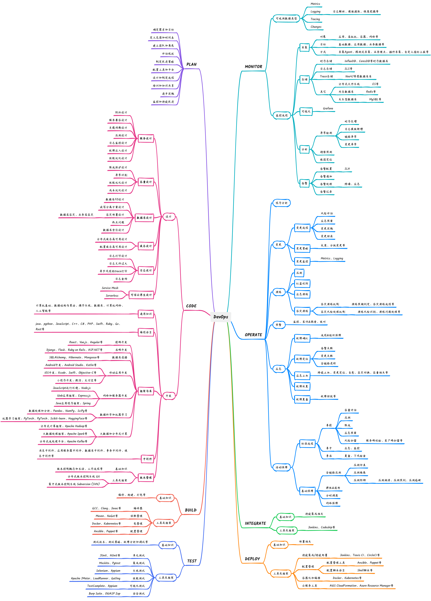

# DevOps-Eval
A DevOps Domain Knowledge Evaluation Benchmark for Large Language Models

<p align="center">
  🤗 <a href="https://huggingface.co/datasets/DevOps-Eval/devopseval-exam" target="_blank">Hugging Face</a> • ⏬ <a href="#data" target="_blank">数据</a> • 📖 <a href="resources/tutorial.md" target="_blank">教程</a>
  <br>
  <a href="https://github.com/codefuse-ai/codefuse-devops-eval/blob/main/README.md"> English</a> | <a href="https://github.com/codefuse-ai/codefuse-devops-eval/blob/main/README_zh.md"> 中文
</p>

DevOps-Eval is a comprehensive evaluation suite specifically designed for foundation models in the DevOps field. It consists of xxxx multi-choice questions spanning 8 diverse disciplines, as shown below.

We hope DevOps-Eval could help developers, especially in the DevOps field, track the progress and analyze the important strengths/shortcomings of their models.




## 更新

* **[2023.09.30]** DevOps-Eval...
<br>
<br>

## 目录

- [排行榜](#排行榜)
- [验证集结果](#验证集结果)
- [数据](#数据)
- [如何进行测试](#如何进行测试)
- [TODO](#todo)
- [Licenses](#licenses)
- [引用](#引用)

## 排行榜
coming soon
<br>
<br>

## 验证集结果
coming soon
<br>
<br>

## 数据
#### 下载
* 方法一：下载zip压缩文件（你也可以直接用浏览器打开下面的链接）：
  ```
  wget https://huggingface.co/datasets/DevOps-Eval/devopseval-exam/resolve/main/data.zip
  ```
  然后可以使用 pandas加载数据：

  ```
  import os
  import pandas as pd
  
  File_Dir="devopseval-exam"
  test_df=pd.read_csv(os.path.join(File_Dir,"test","UnitTesting.csv"))
  ```
* 方法二：使用[Hugging Face datasets](https://huggingface.co/datasets/DevOps-Eval/devopseval-exam)直接加载数据集。示例如下：
  ```python
  from datasets import load_dataset
  dataset=load_dataset(r"DevOps-Eval/devopseval-exam",name="UnitTesting")
  
  print(dataset['val'][0])
  # {"id": 1, "question": "单元测试应该覆盖以下哪些方面？", "A": "正常路径", "B": "异常路径", "C": "边界值条件"，"D": 所有以上，"answer": "D", "explanation": ""}  ```
#### 说明
为了方便使用，我们已经整理出了 49 个细分类别以及它们的中英文名称。具体细节请查看 [category_mapping.json](https://github.com/codefuse-ai/codefuse-devops-eval/category_mapping.json) 。格式如下：

```
{
  "UnitTesting.csv": [
    "unit testing",
    "单元测试",
    "TEST"
  ],
  ...
  "file_name":[
  "英文名称",
  "中文名称",
  "类别(PLAN,CODE,BUILD,TEST,RELEASE,DEPOLY,OPERATE,MONITOR八选一)"
  ]
}
```
每个细分类别由两个部分组成：dev 和 test。每个细分类别的 dev 集包含五个示范实例以及为 few-shot 评估提供的解释。而 test 集则用于模型评估，并且test数据已包含准确标签。

下面是 dev 数据的示例，来自"版本控制"细分类别：
```
id: 1
question: 如何找到Git特定提交中已更改的文件列表？
A: 使用命令 `git diff --name-only SHA`
B: 使用命令 `git log --name-only SHA`
C: 使用命令 `git commit --name-only SHA`
D: 使用命令 `git clone --name-only SHA`
answer: A
explanation: 
分析原因：
git diff --name-only SHA命令会显示与SHA参数对应的提交中已修改的文件列表。参数--name-only让命令只输出文件名，而忽略其他信息。其它选项中的命令并不能实现此功能。
```

## 如何进行测试
如果需要在自己的 huggingface 格式的模型上进行测试的话，总的步骤分为如下几步:
1. 编写 Model 的 loader 函数
2. 编写 Model 的 context_builder 函数
3. 注册模型到配置文件中
4. 执行测试脚本
如果模型在加载进来后不需要特殊的处理，而且输入也不需要转换为特定的格式（e.g. chatml 格式或者其他的 human-bot 格式），请直接跳转到第四步直接发起测试。

#### 1. 编写 loader 函数
如果模型在加载进来还需要做一些额外的处理（e.g. tokenizer 调整），需要去 `src.context_builder.context_builder_family.py` 中继承 `ModelAndTokenizerLoader` 类来覆写对应的 `load_model` 和 `load_tokenizer` 函数，具体可以参照以下示例：
```python
class QwenModelAndTokenizerLoader(ModelAndTokenizerLoader):
    def __init__(self):
        super().__init__()
        pass
      
    def load_model(self, model_path: str):
        model = super().load_model(model_path)
        model.generation_config = GenerationConfig.from_pretrained(model_path)
        return model
    
    def load_tokenizer(self, model_path: str):
        tokenizer = super().load_tokenizer(model_path)
    
        # read generation config
        with open(model_path + '/generation_config.json', 'r') as f:
        generation_config = json.load(f)
        tokenizer.pad_token_id = generation_config['pad_token_id']
        tokenizer.eos_token_id = generation_config['eos_token_id']
        return tokenizer
```

#### 2. 编写 Model 的 context_builder 函数
如果输入需要转换为特定的格式（e.g. chatml 格式或者其他的 human-bot 格式），则需要去 `src.context_builder.context_builder_family` 中继承 ContextBuilder 类来覆写 make_context 函数，这个函数是用来将输入转换格式为对应需要的输出的，一个示例如下：
```python
class QwenChatContextBuilder(ContextBuilder):
    def __init__(self):
        super().__init__()
    
    def make_context(
        self,
        model,
        tokenizer, 
        query: str,
        system: str = "you are a helpful assistant"
    ):
      '''
  model: PretrainedModel
  tokenizer: PretrainedTokenzier
  query: Input string
  system: System prompt if needed
  '''
        im_start, im_end = "<|im_start|>", "<|im_end|>"
        im_start_tokens = [tokenizer.im_start_id]
        im_end_tokens = [tokenizer.im_end_id]
        nl_tokens = tokenizer.encode("\n")

        def _tokenize_str(role, content):
            return f"{role}\n{content}", tokenizer.encode(
                role, allowed_special=set()
            ) + nl_tokens + tokenizer.encode(content, allowed_special=set())

        system_text, system_tokens_part = _tokenize_str("system", system)
        system_tokens = im_start_tokens + system_tokens_part + im_end_tokens

        raw_text = ""
        context_tokens = []

        context_tokens = system_tokens + context_tokens
        raw_text = f"{im_start}{system_text}{im_end}" + raw_text
        context_tokens += (
            nl_tokens
            + im_start_tokens
            + _tokenize_str("user", query)[1]
            + im_end_tokens
            + nl_tokens
            + im_start_tokens
            + tokenizer.encode("assistant")
            + nl_tokens
        )
        raw_text += f"\n{im_start}user\n{query}{im_end}\n{im_start}assistant\n"
        return raw_text, context_tokens
```

#### 3. 注册模型到配置文件中
去 conf 中的 `model_conf.json`，注册对应的模型名和这个模型将要使用的 loader 和 context_builder，其中 loader 和 context_builder 写第一步和第二步中自定义的类名就可以，示例如下：
```json
{
  "Qwen-Chat": {
  "loader": "QwenModelAndTokenizerLoader",
  "context_builder": "QwenChatContextBuilder"
  }
}
```


#### 4. 执行测试脚本
直接运行以下代码发起测试
```Bash
# model_path: 要测试的模型路径
# model_name: 模型配置文件对应的模型命名，默认为 Default ，代表走默认的 loader 和 context_builder
# model_conf_path: 模型配置文件的地址，一般就为 conf 路径下的 devopseval_dataset_fp.json
# eval_dataset_list: 要测试的数据集名称，默认 all，全部测试，如果需要测试单个或者多个，用 # 符号链接，示例：dataset1#dataset2
# eval_dataset_fp_conf_path: 数据集配置地址
# eval_dataset_type: 测试哪种类型，只支持默认 test 类型的测试集
# data_path: 评测数据集地址，填写下载数据集后的地址就可以
# k_shot: 支持 0-5，代表 few-shot 会给模型前缀加的示例数量

  
python src/run_eval.py \
--model_path path_to_model \
--model_name model_name_in_conf \
--model_conf_path path_to_model_conf \
--eval_dataset_list all \
--eval_dataset_fp_conf_path path_to_dataset_conf \
--eval_dataset_type test \
--data_path path_to_downloaded_devops_eval_data \
--k_shot 0
```

举个🌰：比如评测数据集下载到了 `folder1`，代码放在了 `folder2`，模型在 `folder3`，模型不需要自定义 loader 和 context_builder，需要测试所有的数据集的 zero-shot 得分，那可以按照以下脚本发起测试：
```Bash
python folder2/src/run_eval.py \
--model_path folder3 \
--model_name Default \
--model_conf_path folder1/conf/model_conf.json \
--eval_dataset_list all \
--eval_dataset_fp_conf_path folder1/conf/devopseval_dataset_fp.json \
--eval_dataset_type test \
--data_path folder2 \
--k_shot 0
```
<br>

## TODO
<br>
<br>

## Licenses

[](https://lbesson.mit-license.org/)

本项目遵循 [MIT License](https://lbesson.mit-license.org/).

<br>
<br>

## 引用

如果您使用了我们的数据集，请引用我们的论文。
<br>
<br>
