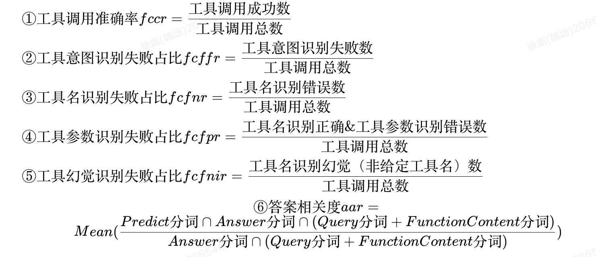

### 数据样例
在数据上我们完全兼容了 OpenAI Function Calling，具体格式如下：

**Function Call的数据格式**

| Input Key | Input Type | Input Description |
| --- | --- | --- |
| functions | List[Swagger] | 工具集合 |
| chatrounds | List[chatround] | 多轮对话数据 |

**chatrounds的数据格式**

| Input Key | Input Type | Input Description |
| --- | --- | --- |
| role | string | 角色名称，包含三种类别，user、assistant、function |
| name | string | 若role为function，则存在name字段，为function的名称 |
| content | string | role的返回内容 |
| function_call | dict | 工具调用 |

```
{
    "functions":
    [
        {
            "name": "get_fudan_university_scoreline",
            "description": "查询复旦大学往年分数线，例如：查询2020年复旦大学的分数线",
            "parameters":
            {
                "type": "object",
                "properties":
                {
                    "year":
                    {
                        "type": "string",
                        "description": "年份，例如：2020，2019，2018"
                    }
                },
                "required":
                [
                    "year"
                ]
            }
        }
    ],
    "chatrounds":
    [
        {
            "role": "system",
            "content": "CodeFuse是一个面向研发领域的智能助手，旨在中立的、无害的帮助用户解决开发相关的问题，所有的回答均使用Markdown格式返回。\n你能利用许多工具和功能来完成给定的任务，在每一步中，你需要分析当前状态，并通过执行函数调用来确定下一步的行动方向。你可以进行多次尝试。如果你计划连续尝试不同的条件，请每次尝试一种条件。若给定了Finish函数,则以Finish调用结束，若没提供Finish函数，则以不带function_call的对话结束。"
        },
        {
            "role": "user",
            "content": "查询2020年复旦大学的分数线"
        },
        {
            "role": "assistant",
            "content": null,
            "function_call":
            {
                "name": "get_fudan_university_scoreline",
                "arguments": "{\n  \"year\": \"2020\"\n}"
            }
        },
        {
            "role": "function",
            "name": "get_fudan_university_scoreline",
            "content": "{\n    \"scoreline\":{\n        \"文科一批\": 630,    \n        \"文科二批\": 610,  \n        \"理科一批\": 650,  \n        \"理科二批\": 630  \n    }\n}"
        },
        {
            "role": "assistant",
            "content": "2020年复旦大学的分数线如下：\n\n- 文科一批：630分\n- 文科二批：610分\n- 理科一批：650分\n- 理科二批：630分"
        }
    ]
}
```

上述Function Call的数据样例为给定特定工具集后，用于回答用户查询某高校录取分数线的问题。


### 评测指标
由于一般通用模型无法具备工具调用的能力，因此在进行Tool Learn-Eval评测之前需要对通用模型进行微调，先让模型学会工具使用的基本范式

下面，我们定义了几种评估工具使用的指标：



②③④⑤的和为1，代表工具调用失败的总数，⑤工具幻觉是工具名识别失败的一种特殊情况